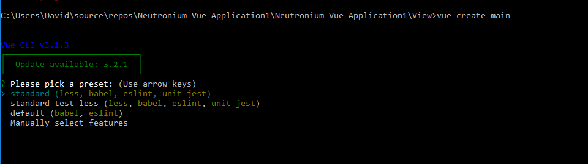
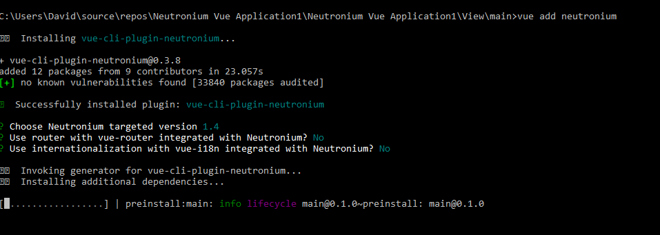
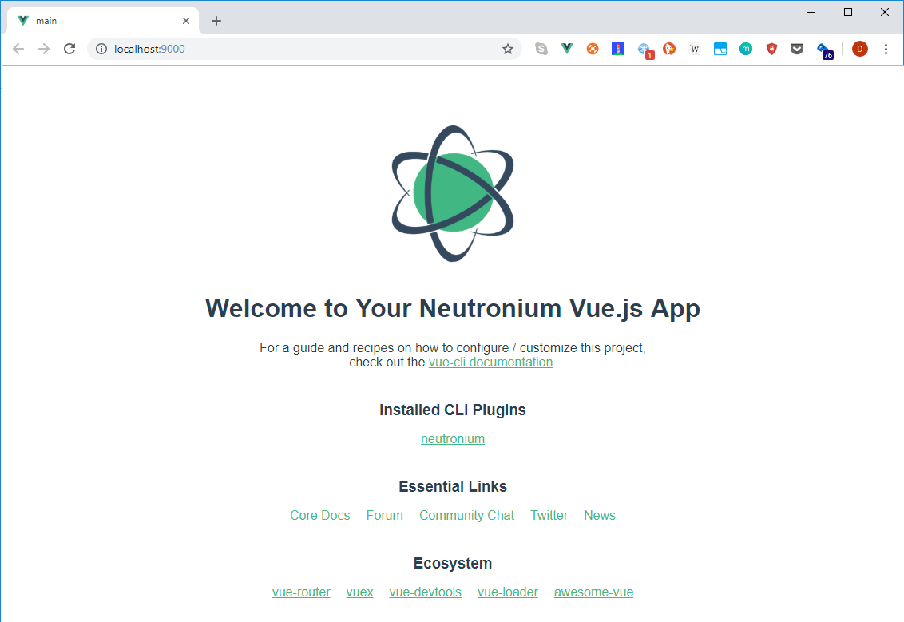
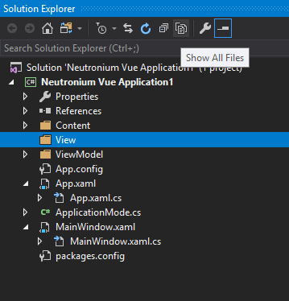
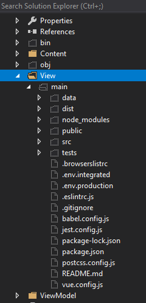
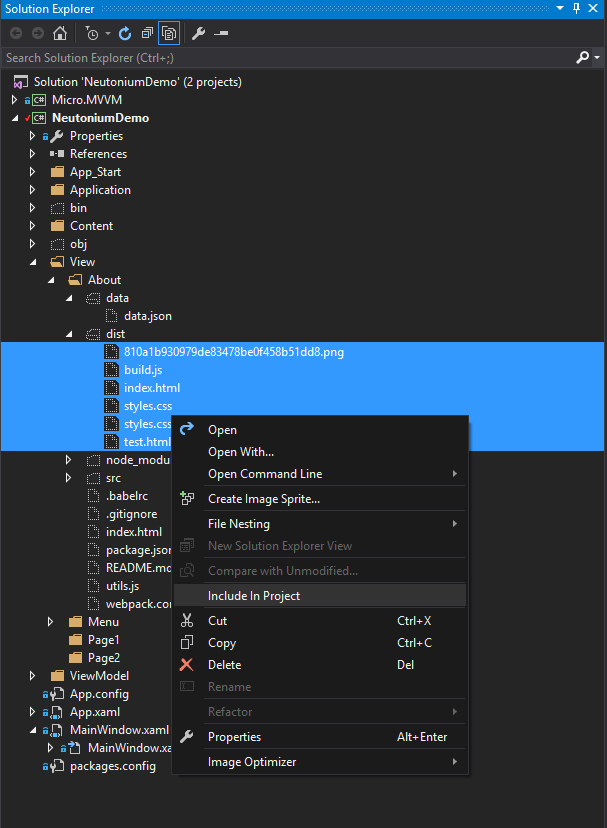
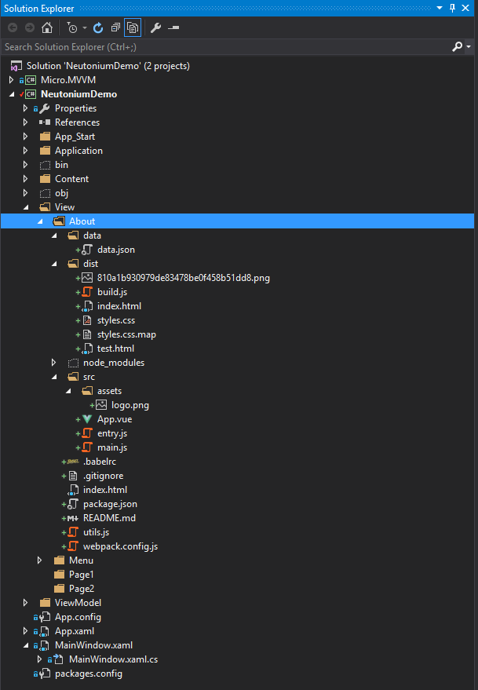
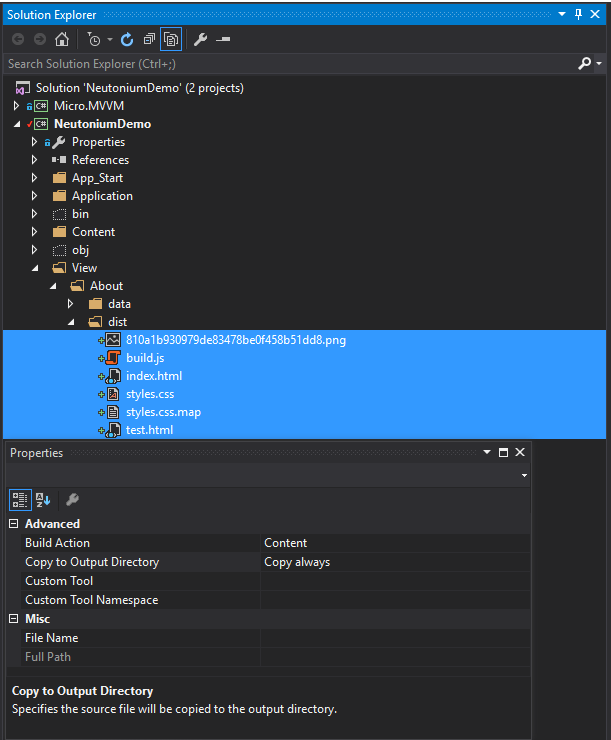
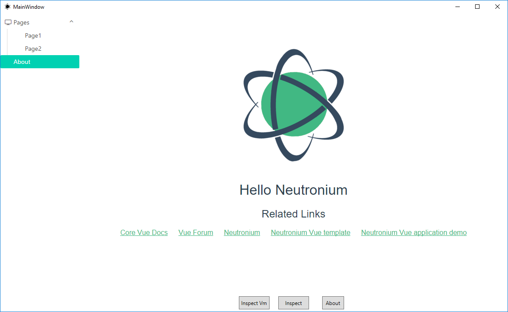

<p align="center"></p>

# Vue cli template

Neutronium provides a vue-cli 3 plugin [vue-cli-plugin-neutronium](https://github.com/NeutroniumCore/vue-cli-plugin-neutronium) that provides many advantages to develop large project with Neutronium vue:
* During development use web-pack-dev-server and chrome to create the UI
* Use ES6, sass, less...
* Decompose your project in easy to maintain vue files during development
* Use npm to manage your dependencies
* Use Webpack build to generate all files you need to reference in Neutronium

See [vue-cli-plugin-neutronium Readme](https://github.com/NeutroniumCore/vue-cli-plugin-neutronium) for complete description.

To install neutronium  vue template use [vue-cli 3](https://cli.vuejs.org/)
If not installed, install first vue-cli:

``` bash
$ npm install -g vue-cli
```

Then in the view folder create your project 
``` bash
$ vue create main
$ cd main
$ vue add neutronium
$ npm install
$ npm run serve
```

## npm scripts

```bash
npm run serve
```
Debug your view in the browser. Main view model data are provided by cjson (circular JSON) file: data\vm.cjson

```bash
npm run live
```
Serve locally view that can be used in live reload setting with Neutronium.

```bash
npm run build
```
Generate files ready to be used in Neutronium in the dist folder: you have to reference these files (Content/Copy Always) in visual studio.


## Step by step installation
1. Open folder where you want to install the view from VS<br>
<br>
2. Install template
``` bash
$ vue create main
```



``` bash
$ cd main
$ vue add neutronium
```


Choose the correct options:



4. Begin developing the view using hot-reload (you may use atom or sublime to edit js files)
``` bash
$ npm install
$ npm run serve
```


5. Once the view is ready build the files
``` bash
$ npm run build
```


6. Include the files in VD<br>
* Click show all files<br>
<br><br>
<br>

* Include the files in project: DO NOT INCLUDE files under node_modules<br>
<br><br>
<br>

* Set Properties on dist files: 
  - Build Action: `Resource`
  - Copy To Folder: `None`<br>
  - `.legacy.` files in dist folder don't need to be included in the project<br><br>
<br>

7. Run C# application<br>
<br>


## Folder organization

``` bash
├── data
├── dist
├── src
│   ├── asset
│   ├── components
│   ├── App.vue
│   ├── entry.js
│   ├── install.js
│   └── main.js
├── index.hml
``` 

`Data`: contains the vm.cjson which is the viewmodel data used during development in the browser.
`dist`: contains generated files to be used in Neutronium
`src`: contains assets (folder assets), vue components (folder components), main component: App.vue.
You should not edit `entry.js` nor `main.js` which are boilerplate files needed for the dev and production build.
Both index.html files (fromm root and dist) should not be edited for the same reason.

## Main file:

App.Vue represent the main entry of the vue application, its prop ``mainViewModel``` represent the C# viewModel

### Install.js file

If you need to register globally plugin in Vue instance use install.js.
Example:

```javascript
import Notifications from 'vue-notification'

function install(vue) {
    vue.use(Notifications)
}

export {
    install
} 
```

For version >=1.0.0, it is also possible to use install.js to set Vue instance options.
This is needed if you want to use mixins, or some popular tools such as [vue-router](https://router.vuejs.org/en/) or [vue-i18n](https://github.com/kazupon/vue-i18n).
To do so you need to export a vueInstanceOption function returning Vue instance option.

Example:

```javascript
import VueI18n from 'vue-i18n'
import {messages} from './messages'

function install(vue) {
    //Call vue use here if needed
    vue.use(VueI18n);
}

function vueInstanceOption() {
    const i18n = new VueI18n({
        locale: 'ru', // set locale
        messages, // set locale messages
    });

    //Return vue global option here, such as vue-router, vue-i18n, mix-ins, .... 
    return {i18n}
}

export {
    install,
    vueInstanceOption
} 
```


## Tips:

You can generate a Json from viewModel captured in a Neutronium debug session using [Neutronium debug tools](./Debug.md) and use it as data.json in order to create the view with a realistic ViewModel. 


### [Additional vue.js components](./Using_aditional_dedicated_vue.js_component.md)

[How to set up a project](./SetUp.md) - [Debug Tools](./Debug.md) - [Architecture](./Architecture.md) - [F.A.Q](./FAQ.md)

