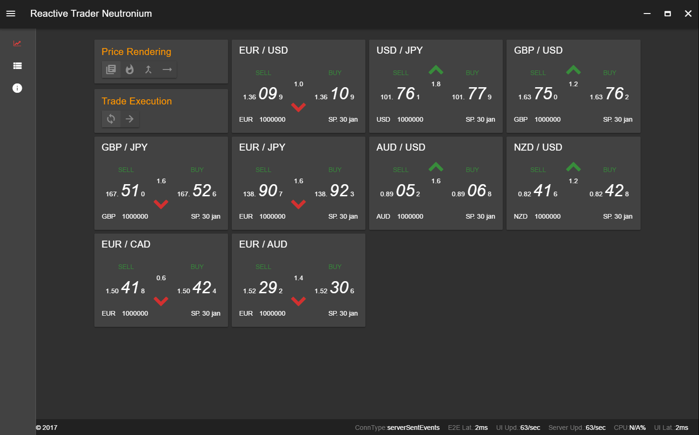
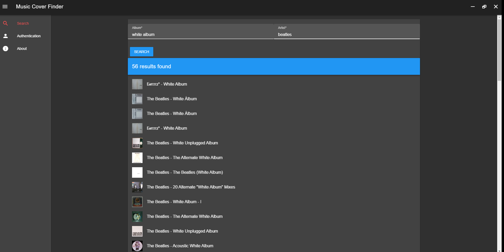

# Applications Made with Neutronium

## ReactiveTrader Neutronium

[https://github.com/David-Desmaisons/ReactiveTrader/tree/neutronium_implementation](https://github.com/David-Desmaisons/ReactiveTrader/tree/neutronium_implementation)

Alternative UI for [ReativeTrade application](https://github.com/AdaptiveConsulting/ReactiveTrader). 

> 
> 
> 

## Music.Cover.Finder
[https://github.com/David-Desmaisons/Music.Cover.Finder](https://github.com/David-Desmaisons/Music.Cover.Finder)

Application to Find disc cover art based on [discogs API](https://www.discogs.com/). Based on `Neutronium.SPA.Demo`.

> 

## CodeDependencyScaner
[https://github.com/NeutroniumCore/CodeDependencyScanner](https://github.com/NeutroniumCore/CodeDependencyScanner)

Codegravity is a demonstration application (working still in progress) showcasing neutronium + Vue + D3.js in context of C# code analysis.

> 

## Neutronium.SPA.Demo
[https://github.com/NeutroniumCore/Neutronium.SPA.Demo](https://github.com/NeutroniumCore/Neutronium.SPA.Demo)

Neutronium.SPA.Demo is a scaffold Vue.js reference project that can be used as a starter or reference when building a large project.
It includes IoC (example Ninject but easily changeable), navigation with integration with vue-router, internalization with integration with vue-i18n. Built on top of Vuetify.js.

 

## NeutroniumDemo
[https://github.com/NeutroniumCore/NeutroniumDemo](https://github.com/NeutroniumCore/NeutroniumDemo)

NeutroniumDemo is a scaffold project including logging, IoC, navigation, demonstrating how you can structure/architecture a project with neutronium.
It is using [navigation API](./Navigation.md) to navigate between ViewModels. 

[How to set up a project](./SetUp.md) - [Overview](./Overview.md) - [Architecture](./Architecture.md) - [F.A.Q](./FAQ.md)
