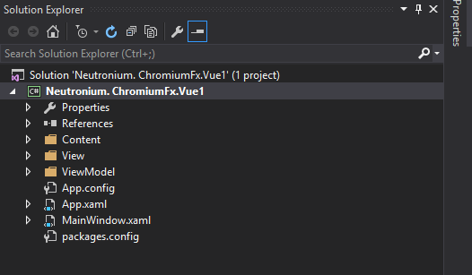

# Set Up a Neutronium application

## Using Neutronium template

The best way to start with Neutronium is to download template C# solution [from visual studio gallery](https://visualstudiogallery.msdn.microsoft.com/c7679997-e25b-4a79-a65f-30758fb756d8).

Template application will install nuget dependencies and scaffold a very simple solution including simple View HTML and View Model.

### Step by step installation
1. Download Neutronium template from visual studio gallery 

 
2. Install template 

 
3. In Visual Studio, choose new project, Neutronim Template 
 
 
 

## From scratch

To be done

