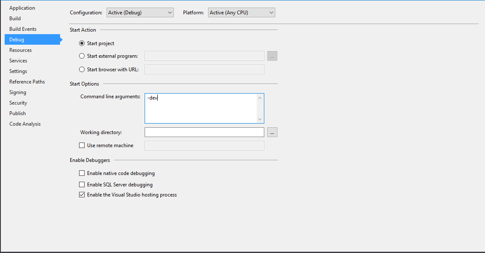

# Create a Neutronium application from scratch

## Getting started

Best way to start is to install [Visual Studio Template](https://visualstudiogallery.msdn.microsoft.com/c7679997-e25b-4a79-a65f-30758fb756d8) (see complete instruction [here]((../SetUp.md) )) which contains 3 templates:

* Neutronium knockout Application

  knockout basic start-up project.

* Neutronium Vue Application

  Vue start-up project. 
Shipped with [neutronium-vue template](https://github.com/NeutroniumCore/neutronium-vue) that uses webpack to bundle javascript files.
Use: 
  * `npm run dev` to develop application in the browser.
  * `npm run integrated` to serve js file in way that can be used in hot-reload mode. See below.
  * `npm run build` to create js file that while be loaded and used inNeutronium application.

  The provided Neutronium application can be runt in 3 modes:
  * `-dev` development mode with hot-reload enable. You should run `npm run integrated` before running the application in this mode. In this mode, it is possible to edit javascript, CSS and HTML and to see the changes in a running Neutronium application.
  * `-test` test mode: Neutronium debug is allowed but files from the build are used. No hot-reload
  * `-prod` production mode: no Neutronium debug allowed. Build files are used

`Production mode` is the only possible mode when using none-debug build. 
`Test mode` is the default mode when building in debug mode. 
To switch the different modes, use the Visual studio `Project Property>Debug` window: 

 

* Neutronium.Vue.SPA
This template contains all of `Neutronium Vue Application` template features. In addition, it contains:
  * Dependency injection using `CommonServiceLocator` pattern so that it is possible to switch IOC implementation. The template comes with [Ninject](http://www.ninject.org) but [Neutronium ReactiveTrader](https://github.com/David-Desmaisons/ReactiveTrader/tree/neutronium_implementation) is an example using [Autofac](https://autofac.org).
  * Routing integrated with [vue-router](https://router.vuejs.org/en/)
  * Localization via [vue-i18n](https://kazupon.github.io/vue-i18n/en/)

Complete documentation can be found [here](https://github.com/NeutroniumCore/Neutronium.SPA.Template)

It can be used as a start-up for a new application as well as a starting point to create your own template

