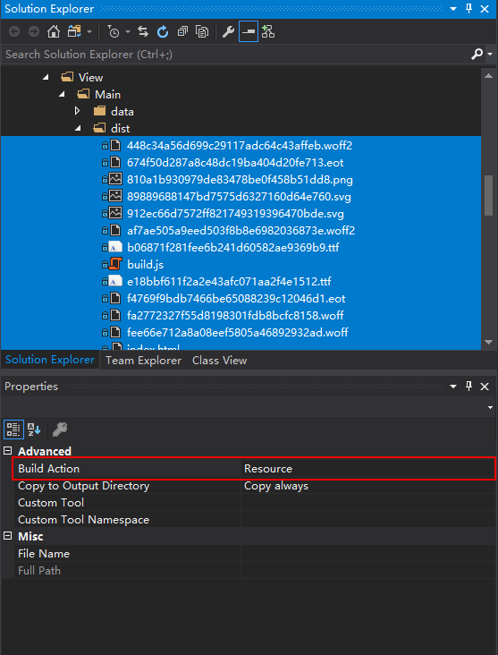

<p align="center"></p>

# Using pack uri 

## Step by step

1. Change html assets `Build Action` from `Content` to `Resource`.

<p align="center"></p>

2. Change HtmlViewControl's `RelativeSource` property to `Uri` with pack uri.

 ```xml
<Grid>
    <wpf:HTMLViewControl RelativeSource="View/Main/dist/index.html" IsDebug="true" JavascriptUIEngine="VueInjectorV2" x:Name="wcBrowser"  HorizontalAlignment="Stretch" VerticalAlignment="Stretch" />
</Grid>
 ```
To
```xml
<Grid>
    <wpf:HTMLViewControl Uri="pack://application:,,,/View/Main/dist/index.html" IsDebug="true" JavascriptUIEngine="VueInjectorV2" x:Name="wcBrowser"  HorizontalAlignment="Stretch" VerticalAlignment="Stretch" />
</Grid>
 ```