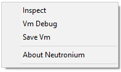
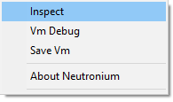
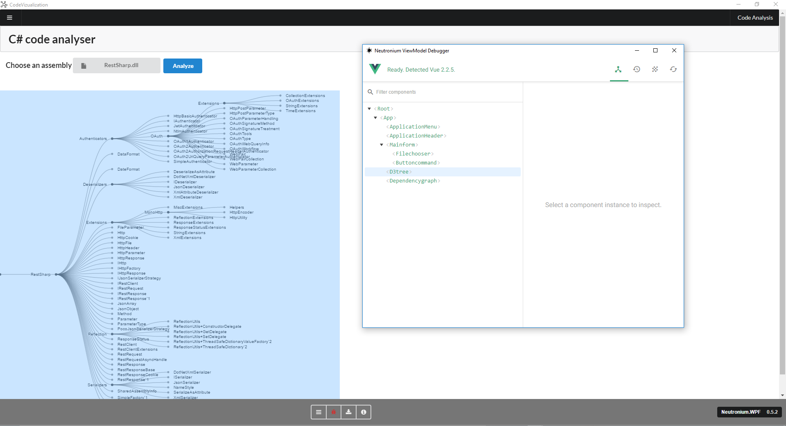
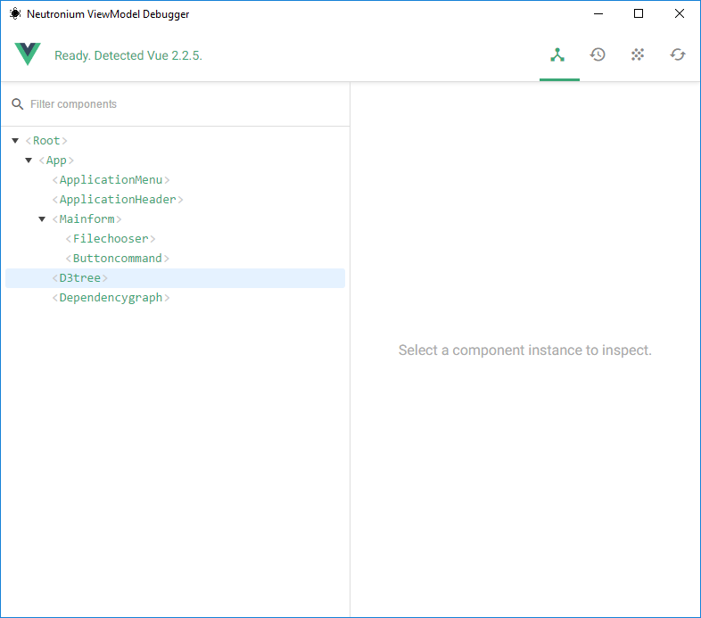
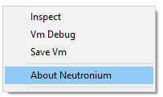

# Debug Tools

## Interactive Debug

Note: To activate Debug mode for `HTLMLWindow` or `HTMLViewControl` set the property IsDebug as true

In debug mode, the following context menu will be displayed:




### 1. Inspect

Opens a fully featured chromium javascript debug windows




### 2 Vm Debug

Opens a javascript framework specific window to display information about the binding:


- For Vue.js

The [vue chrome debug tool](https://github.com/vuejs/vue-devtools) is opened in new window






- For Knockout

An adaption of [knockout-view] a debug tool [displaying ViewModel is used](https://github.com/jmeas/knockout-view)

### 3 Save Vm


Allows to save the value of the bound DataContext to a circular JSON (`.cjson`). This is a very interesting feature when coupled with [neutronium vue webpack template](../tools/vue-cli-plugin.html). Indeed neutronium Webpack configuration can use this files as "fake" ViewModel. 

This is very powerful when coupled with live reload feature as saving a ViewModel will update the corresponding browser when using `npm run dev`.

### 4 About 
Opens a windows displaying information about Neutronium configuration:




## Trace 

By default, Neutronium will use the trace listener to log events. 
Neutronium will log binding errors as well as console.log message from the HTML session. 

If you need to use a different logger to output the Neutronium events you can implement your own IWebSessionLogger:


```CSharp
    public interface IWebSessionLogger
    {
        /// <summary>
        /// Called for debug logging
        /// </summary>
        void Debug(Func<string> information);

        /// <summary>
        /// Called for debug logging
        /// </summary>
        void Debug(string information);

        /// <summary>
        /// Called for information logging
        /// </summary>
        void Info(string information);

        /// <summary>
        /// called for information logging 
        /// </summary>
        void Info(Func<string> information);

        /// <summary>
        /// Called for warning 
        /// </summary>
        void Warning(string information);

        /// <summary>
        /// Called for warning 
        /// </summary>
        void Warning(Func<string> information);

        /// <summary>
        /// Called on critical event 
        /// </summary>
        void Error(string information);

        /// <summary>
        /// Called on critical event 
        /// </summary>
        void Error(Func<string> information);

        /// <summary>
        /// Called on each console log called by browser 
        /// </summary>
        void LogBrowser(ConsoleMessageArgs information, Uri url);

        /// <summary>
        /// Called in case of browser critical error
        /// </summary>
        /// <param name="exception">
        /// Exception responsible for the error
        /// </param>
        /// <param name="cancel">
        /// Action to be called to cancel browser closing,
        /// has an effect only with Awesomium
        /// </param>
        void WebBrowserError(Exception exception, Action cancel);
    }
}

```

And then setting Neutronium Engine session logger:

```CSharp
var myLogger = new MyLogger();
HTMLEngineFactory.Engine.WebSessionLogger = myLogger;

```
