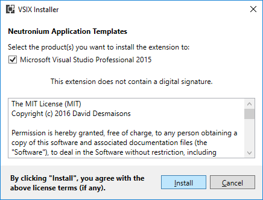

# Getting started with Neutronium

## Using Neutronium template

The best way to start with Neutronium is to download template C# solution [from visual studio gallery](https://visualstudiogallery.msdn.microsoft.com/c7679997-e25b-4a79-a65f-30758fb756d8).

Template application will install nuget dependencies and scaffold a very simple solution including simple View HTML and View Model.

### 1. Download Neutronium template from visual studio gallery<br>

<br>
### 2. Install template<br>

<br>
### 3. In Visual Studio, choose new project, Neutronium Template<br>
<br>
<br>
<br>

### 4. Build the project using restore missing nuget option

### 5. Build vue files using npm

    In project folder:
``` bash
$ cd View
$ cd Main
$ npm install
$ npm run build
```

Neutronium template uses [vue-cli](https://cli.vuejs.org/) and [vue-cli-plugin-neutronium](https://github.com/NeutroniumCore/vue-cli-plugin-neutronium).

[See here](./Build_large_project_with_Vue.js_and_Webpack.md) detailed description how to use it.


## From scratch

### New project

#### 1. Create a WPF application
#### 2. Install nuget `Neutronium.ChromiumFx.Vue`

<br>

#### 3. Update `App.cs` and `App.xaml` to initialize Neutronium engines

`App.cs`
```CSharp
using Neutronium.Core.JavascriptFramework;
using Neutronium.WebBrowserEngine.ChromiumFx;
using Neutronium.JavascriptFramework.Vue;

namespace NeutroniumApplication
{
    /// <summary>
    /// Interaction logic for App.xaml
    /// </summary>
    public partial class App : ChromiumFxWebBrowserApp
    {
        protected override IJavascriptFrameworkManager GetJavascriptUIFrameworkManager()
        {
            return new VueSessionInjectorV2();
        }
    }
}
```

`App.xaml`
```HTML
<neutroniumCfx:ChromiumFxWebBrowserApp x:Class="NeutronimApplication.App"
             xmlns="http://schemas.microsoft.com/winfx/2006/xaml/presentation"
             xmlns:x="http://schemas.microsoft.com/winfx/2006/xaml"
             xmlns:local="clr-namespace:NeutronimApplication"
             xmlns:neutroniumCfx="clr-namespace:Neutronium.WebBrowserEngine.ChromiumFx;assembly=Neutronium.WebBrowserEngine.ChromiumFx"                                 
             StartupUri="MainWindow.xaml">
    <neutroniumCfx:ChromiumFxWebBrowserApp.Resources>
    </neutroniumCfx:ChromiumFxWebBrowserApp.Resources>
</neutroniumCfx:ChromiumFxWebBrowserApp>
```

#### 4. Update `MainWindow.cs` and `MainWindow.xaml` to use Neutronium UserControl

`MainWindow.cs`
```CSharp
public partial class MainWindow : Window
{
	public MainWindow()
	{
		InitializeComponent();
		
		// Initialize application and set-up a none-null dataContext here
		// If the data context is null nothing will be displayed
		DataContext = ..
	}

	protected override void OnClosed(EventArgs e)
	{
		this.HtmlView.Dispose();
	}
}
```

 `MainWindow.xaml`
```HTML
<Window x:Class="NeutronimApplication.MainWindow"
        xmlns:neutronium="clr-namespace:Neutronium.WPF;assembly=Neutronium.WPF" 
        xmlns="http://schemas.microsoft.com/winfx/2006/xaml/presentation"
        xmlns:x="http://schemas.microsoft.com/winfx/2006/xaml"
        xmlns:d="http://schemas.microsoft.com/expression/blend/2008"
        xmlns:mc="http://schemas.openxmlformats.org/markup-compatibility/2006"
        xmlns:local="clr-namespace:NeutronimApplication"
        mc:Ignorable="d"
        Title="MainWindow" Height="350" Width="525">
    <Grid>
        <neutronium:HTMLViewControl x:Name="HtmlView" IsDebug="True" Uri="pack://application:,,,//View/MainView/dist/index.html" HorizontalAlignment="Stretch" VerticalAlignment="Stretch"/>
    </Grid>
</Window>
```

#### 5. Install HTML/Vue template

It is strongly recommended to use `vue cli neutronium` to bootstrap the project and develop Neutronium application [described here](./large-project.html).

In this example you should install template under View folder creating a MainView view.

### For an existing WPF project

Follow steps 2 to 5 from new project set-up.

If it is not possible to change App inheritance, Neutronium should be initialized once like this:
```CSharp
using Neutronium.Core.JavascriptFramework;
using Neutronium.WebBrowserEngine.ChromiumFx;
using Neutronium.JavascriptFramework.Vue;

\\....
var engine = HTMLEngineFactory.Engine;
engine.RegisterHTMLEngine(new ChromiumFXWPFWebWindowFactory());
engine.RegisterJavaScriptFramework(new VueSessionInjectorV2());
```

In this case, you should call on application shutdown:
```CSharp
HTMLEngineFactory.Engine.Dispose();
```

