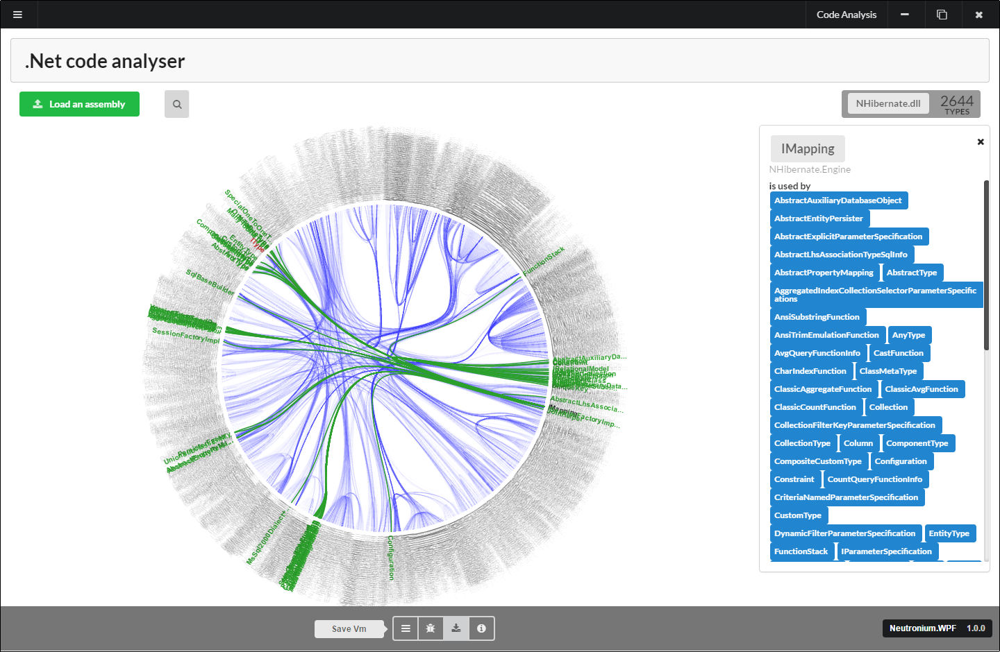

# Neutronium

* Neutronium is an UI framework for .Net.

* It uses the [MVVM architecture](https://www.wikiwand.com/en/Model%E2%80%93view%E2%80%93viewmodel).
  * Using same binding conventions as WPF

> 

* The view layer is composed of
  * an embedded HTML browser
  * a reactive javascript framework. Currently supported are: 
    * [vue.js](https://vuejs.org/), 
    * [knockout.js](https://knockoutjs.com/)
    * [mobX](https://mobx.js.org/)

* Its architecture is pluggable: 
   Different javascript framework and/or webBrowser can be plugged in without changing the core infrastructure.

* It can be used:
  * To build application from scratch
  * To add a dedicated HTML component to an already existent Wpf application
  * To replace an already existing Wpf application, as the existing viewModels can be reused without alteration in Neutronium.

Screenshots from Neutronium applications:

> 
> 
